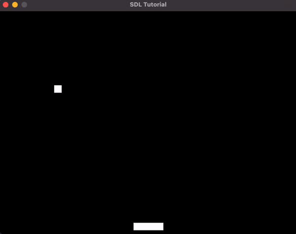

# Pong Game

This project is a simple implementation of the classic Pong game using SDL2. The game features a ball and paddle, where the ball bounces off the paddle and the walls. The player controls the paddle to prevent the ball from hitting the bottom of the screen. The game supports pausing, restarting, and debug mode.



## Features

- **Ball and Paddle Mechanics**: The ball bounces off the paddle and walls, and the paddle can be moved left and right to prevent the ball from falling.
- **Levels**: The game doesn't have levels, but the speed of the ball (and paddle) increases when bounces from the walls.
- **Collision Detection**: Uses Axis-Aligned Bounding Box (AABB) collision detection to handle collisions between the ball and paddle.
- **Game States**: Supports pausing, restarting, and game over states.
- **Debug Mode**: Provides debug output to the console for game state changes and collisions.

## Controls

- **Left Arrow**: Move paddle to the left.
- **Right Arrow**: Move paddle to the right.
- **Space**: Toggle pause.
- **R**: Restart the game.
- **Escape**: Quit the game.

## Command Line Arguments

- `--debug`: Enable debug mode.

## Dependencies

- **SDL2**: Simple DirectMedia Layer library for handling graphics, input, and events.

## Building and Running

To build and run the game, you need to have SDL2 installed. I _think_*, you could use the following commands to compile and run the game:

```bash
$ gcc -o pong main.c -lSDL2
$ ./pong --debug
```

\* I'm using macos with brew and for some reason the SDL2 needs to be linked from `/opt/homebrew/opt/sdl2/include`

## Acknowledgment

This code is part of the tutorial [Creating a Game Loop with C & SDL](https://www.youtube.com/watch?v=XfZ6WrV5Z7Y) by [Pikuma](https://pikuma.com/).
